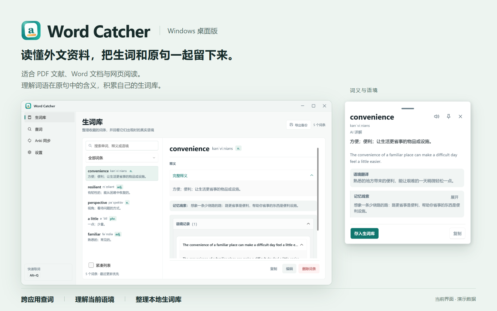

  
  <h1>Word Catcher · Windows 桌面版</h1>
  
读懂外文资料，把生词和原句一起留下来。

  
<a href="https://github.com/qup1010/WordCatcherDesktop/releases">下载桌面版</a> · <a href="https://github.com/qup1010/WordCatcher">浏览器插件</a> · <a href="https://github.com/qup1010/WordCatcherDesktop/issues">反馈问题</a>

Word Catcher 是一款 Windows 查词与生词整理工具，适合阅读 PDF 文献、Word 文档和网页资料。它帮助你理解陌生词语在原句中的含义，并把值得积累的词条与语境保存在本地，方便回顾和整理。

## 选择适合阅读场景的版本

| 产品 | 更适合的场景 | 主要用途 |
| --- | --- | --- |
| **Windows 桌面版（本项目）** | PDF 文献、Word 文档与桌面阅读 | 跨应用查词，积累生词与原句 |
| [浏览器插件](https://github.com/qup1010/WordCatcher) | 外文文章、在线文档与网页资料 | 在当前网页理解词义和语境，回看查询记录 |

两者都提供离线词典、在线快译和 AI 语境详解，可以按阅读场景搭配使用。配置、词典与本地记录各自保存，目前不会自动互通。

## 安装与启动

运行环境：**Windows 10 / 11，x64**。发布的自包含包无需另外安装 .NET。

1. 打开 [Releases](https://github.com/qup1010/WordCatcherDesktop/releases)，下载 `WordCatcher-<版本>-win-x64.zip`。
2. 将压缩包完整解压到一个固定目录，双击 `WordCatcher.App.exe`。
3. 应用启动后常驻右下角托盘。双击 Word Catcher 图标打开主窗口；图标被隐藏时，先展开托盘的折叠区域。
4. 关闭主窗口会收回托盘。需要完全退出时，右键托盘图标，选择「退出」。

ARM 设备暂未提供原生发布包。若从源码运行，请参阅 [开发说明](docs/development.md)。

## 第一次查词

支持可选择、可复制文本的阅读内容；不同应用的选区读取能力有所差异。图片和扫描件需要先通过其他工具进行 OCR，应用目前不提供 OCR。

1. 在阅读软件中选中一个英文单词，松开鼠标。
2. 按 **`Alt+Q`**，松开快捷键后等待查词卡片出现。
3. 查看释义；需要结合原句理解时，点击「AI 详解」。
4. 点击「存入生词库」，保存词条和本次语境。在主窗口的「生词库」中可以回看、搜索和编辑。

无需配置 API Key 就能使用在线机翻；安装离线词典后，命中的短词可以离线查询。AI 详解需要配置自己的 AI 服务。也可以在主窗口的「查词」页手动输入单词、短语或句子，按 `Enter` 查询。

### 三种查询方式

| 方式 | 适合的用途 | 使用条件 |
| --- | --- | --- |
| 离线词典 | 单词、短语的常用义、完整义项、例句和记忆线索 | 先安装词典；命中后无需联网 |
| 在线机翻 | 快速看懂选中文字或整句 | 需要网络；可选择 Microsoft 或 Google |
| AI 详解 | 结合当前原句解释含义并翻译语境 | 需要配置兼容接口、模型和 API Key |

默认查询会先尝试已启用的离线词典，再尝试在线机翻；机翻不可用时会尝试另一服务，最后尝试已配置的 AI。点击「AI 详解」可以直接请求 AI，不必等待自动回退。

离线卡片先展示常用释义，点击「展开全部词性与义项」查看完整内容。保存与复制使用释义摘要，不随展开状态变化。朗读按钮使用 Windows 提供的语音能力，音色取决于本机安装的语音包。

## 安装离线词典

1. 双击托盘图标，进入「设置」，找到离线词典区域。
2. 点击「下载词典」，等待下载、解压和校验完成。安装时可查看进度，也可取消。
3. 确认离线词典已启用，再查询一个常见英文单词。

默认下载 [Open Dictionary](https://github.com/ahpxex/open-dictionary) 的 `distribution.sqlite.gz`。不能直接下载时，可在其 [Releases](https://github.com/ahpxex/open-dictionary/releases) 页面手动下载该文件，再在「词典高级选项」中选择「从文件安装」。也支持解压后的 SQLite 文件；浏览器插件使用的 JSONL 文件不能直接用于桌面版。

修改下载地址、启用状态等设置后，点击「保存所有设置」使其生效。词典未安装、未启用或没有对应词条时，查询会回退到在线服务。

## 配置 AI 详解

1. 打开「设置」中的 AI 配置区域，新建或选中一套配置。
2. 填写服务提供方给出的 **Base URL、模型名称和 API Key**。Base URL 是兼容接口的基础地址，通常包含版本路径，如 `/v1`，不需要填完整的 `/chat/completions` 请求地址。
3. 测试连接，确认地址、密钥和模型可用；然后点击「保存所有设置」。
4. 回到查词卡片，点击「AI 详解」验证实际查询结果。

支持保存多套 AI 配置并切换当前使用的配置。连接成功后，具体模型仍需支持应用使用的结构化输出；接口兼容程度会影响查询结果。API 服务的网络条件、费用和额度由提供方决定。

## 整理生词与日常操作

「生词库」支持搜索单词、释义和语境，按最近更新排序，并按同步状态筛选。点击词条查看释义、记忆线索及每次收藏的原句与来源；列表较长时，可加载更多词条或使用紧凑列表。

- **编辑**：点击「编辑」修改词条；保存失败时保留草稿。
- **删除**：删除本地词条后，可以在本次运行中撤销。删除本地词条不会删除已经写入 Anki 的笔记。
- **固定浮窗**：点击图钉，保持查词浮窗开启；再次取词会更新内容。
- **改快捷键**：在「设置 → 取词快捷键」录入新组合，点击「保存所有设置」。若组合被占用，原快捷键仍会保留。

| 快捷键 | 使用位置与作用 |
| --- | --- |
| `Alt+Q` | 在其他应用中读取选中文字；可在设置中修改 |
| `Ctrl+1` / `2` / `3` / `4` | 主窗口切换生词库、查词、Anki 同步、设置 |
| `Ctrl+F` | 主窗口聚焦搜索或查词输入框 |
| `F2` / `Ctrl+S` / `Esc` | 生词库开始编辑、保存、取消编辑 |
| `Enter` / `Ctrl+Enter` | 查词浮窗保存词条、请求 AI 详解 |
| `Ctrl+P` / `Esc` | 查词浮窗固定或取消固定、关闭浮窗 |

<strong>可选：连接 Anki 复习</strong>

如果你已经使用 Anki，可以将收藏的词条进一步制成复习卡片。查词、语境详解和本地收藏均可独立使用。

1. 安装并打开 [Anki 桌面版](https://apps.ankiweb.net/)。
2. 在 Anki 中打开「工具 → 插件 → 获取插件」，填写 **`2055492159`** 安装 [AnkiConnect](https://ankiweb.net/shared/info/2055492159)，然后重启 Anki。
3. 在 Word Catcher 的「设置」中启用 Anki 同步。默认地址是 `http://127.0.0.1:8765`，默认牌组和笔记类型名称均为 `Word Catcher`。
4. 测试连接并保存设置。保持 Anki 运行，再收藏一个词条。
5. 在「Anki 同步」页查看任务状态，在 Anki 中检查对应牌组与卡片。

保存会先写入本地生词库，再进入同步队列。Anki 暂时不可用时，后台会按间隔重试；重试耗尽或发生无法自动处理的问题时，到「Anki 同步」页查看原因并手动重试。

首次同步会创建所需牌组和笔记类型。使用自定义笔记类型时，需要保留应用所需字段；已有兼容模板不会被自动替换。跨设备复习由 Anki 自身的同步负责，Word Catcher 的本地词库不会因此自动同步。

### Anki 一直显示待同步或同步失败

确认 Anki 已打开、AnkiConnect 已安装，连接地址正确；查看「Anki 同步」页的错误原因。自动重试耗尽后需要手动重试。自定义笔记类型缺少字段时，先调整字段配置。

## 更新应用

在「设置」中检查更新，或直接查看 [Releases](https://github.com/qup1010/WordCatcherDesktop/releases)。有新包时，先从托盘完全退出应用，再解压并运行新版本。程序目录与本机数据目录分开，更新检查只读取 GitHub 的发布信息。

## 数据保存与备份

本机数据目录：`%LocalAppData%\WordCatcher\`。可以将该路径粘贴到资源管理器地址栏打开。

| 文件或目录 | 用途 |
| --- | --- |
| `wordcatcher.db` | 本地词条、语境及同步任务 |
| `settings.json` | 界面、快捷键、AI 连接参数等设置 |
| `secrets.dat` | 使用 Windows DPAPI 按当前用户加密的 API Key |
| `dictionary/` | 已安装的离线词典 |
| `logs/` | 本机运行日志，排查错误时使用 |

在「生词库」页点击「导出备份」，可以导出包含**全部有效词条和语境**的 JSON 文件，不受当前搜索、筛选或列表加载数量影响。文件可以直接查看，但**当前尚未提供 JSON 导入与恢复功能**；也不包含应用设置和 API Key。

### 哪些内容会发送到网络

- 离线词典命中时，查询在本地完成。安装词典时会访问所配置的下载地址。
- 在线机翻会把选中文字发送给实际处理请求的翻译服务。
- AI 详解会把选中文字、可获取的句子上下文、来源窗口标题及可获取的来源地址发送给你配置的 AI 服务。
- 同步 Anki 时会把词条和语境发送到配置的 AnkiConnect 地址，默认是本机地址。

## 常见问题

### 按快捷键没有结果，或取到的内容不对

先确认已经选中文字、快捷键没有被其他应用占用，并保持原窗口处于前台。取词期间切换应用会取消本次请求。也可以在「查词」页手动输入，确认翻译功能本身正常。

应用优先直接读取选区，不支持时使用模拟 `Ctrl+C`。不同阅读器的支持程度不同；遇到无法复制的 PDF 或特殊控件时，无法保证读取成功。普通权限进程向管理员窗口发送模拟输入也会受 Windows 权限限制。

### 取词后剪贴板会被修改吗

直接读取选区成功时不会操作剪贴板。需要模拟复制时，应用会备份原内容，恢复前检查剪贴板是否又被修改；若你随后复制了新内容，会保留新内容。无法完整备份某些特殊格式时，会停止模拟复制。剪贴板持续被占用或系统调用失败时，仍可能无法恢复。

### AI 报错或查不到词

检查 Base URL、API Key、模型名和服务额度，并测试连接。在线机翻和 AI 都需要能访问对应服务；离线词典只覆盖已安装的词条。连接测试通过后，若实际 AI 查询失败，可能与结构化输出兼容性有关。

### 想反馈问题，需要提供什么

在 [Issues](https://github.com/qup1010/WordCatcherDesktop/issues) 中提供应用版本、Windows 版本、使用的软件、复现步骤和错误提示。必要时附上本机日志，分享前检查其中是否包含私人信息。

## 项目与数据来源

- 网页阅读可使用 [Word Catcher 浏览器插件](https://github.com/qup1010/WordCatcher)。
- 构建、测试、目录约定与发布方式见 [开发说明](docs/development.md)；历史调查和验收见 [文档索引](docs/README.md)。
- 离线词典来自 [Open Dictionary](https://github.com/ahpxex/open-dictionary)，数据署名包括 English Wiktionary 及其贡献者、Wiktextract，数据按 [CC BY-SA 4.0](https://github.com/ahpxex/open-dictionary/blob/main/LICENSE-DATA.md) 授权。
- 应用代码与词典数据分别授权；当前桌面仓库尚未提供应用代码的独立 LICENSE 文件。
